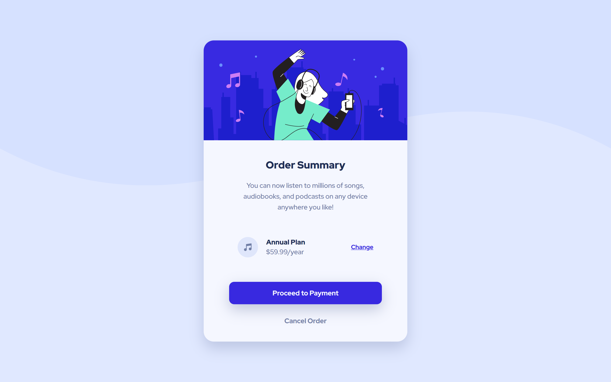
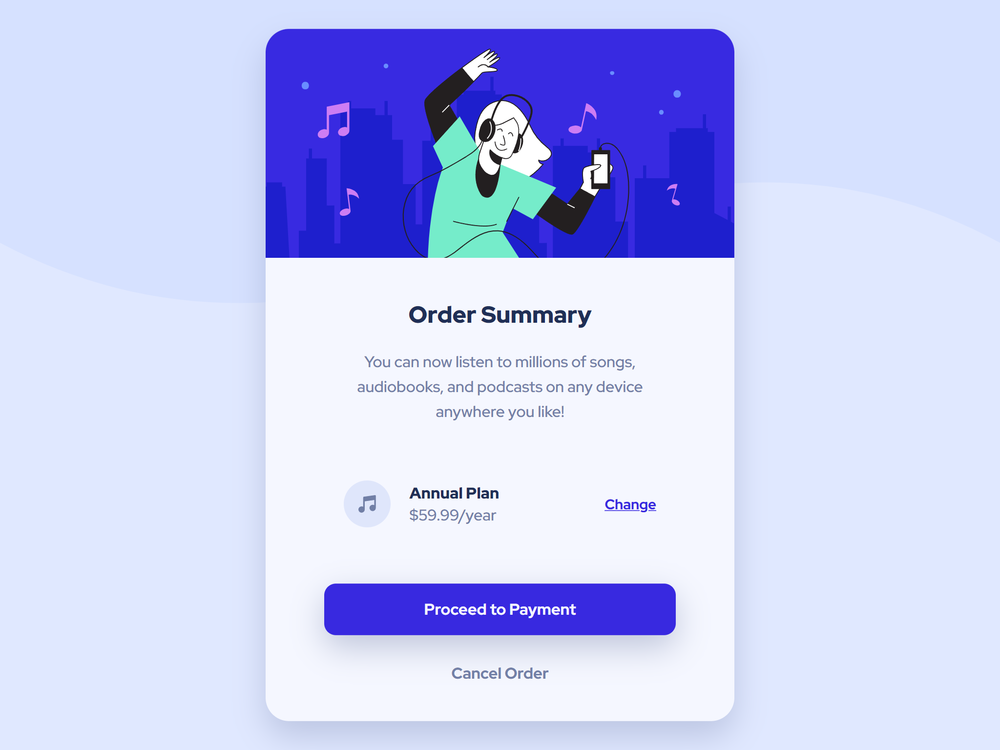

# Frontend Mentor - Order summary card solution

This is a solution to the [Order summary card challenge on Frontend Mentor](https://www.frontendmentor.io/challenges/order-summary-component-QlPmajDUj). Frontend Mentor challenges help you improve your coding skills by building realistic projects. 

## Table of contents

- [Overview](#overview)
  - [The challenge](#the-challenge)
  - [Screenshot](#screenshot)
  - [Links](#links)
- [My process](#my-process)
  - [Built with](#built-with)
  - [What I learned](#what-i-learned)
  - [Continued development](#continued-development)
  - [Useful resources](#useful-resources)
- [Author](#author)
- [Acknowledgments](#acknowledgments)

## Overview

### The challenge

Users should be able to:

- See hover states for interactive elements

### Screenshot

### Links

- Solution URL: [GitHub](https://github.com/westbrookad/order-summary-component)
- Live Site URL: [GitHub Page](https://westbrookad.github.io/order-summary-component/)

## My process

I wrote down the semantics of the html first, then classes and all that.
Next I did the CSS styling with SCSS, using a simple anb short CSS-reset I found on css-tricks.

### Built with

- Semantic HTML5
- SCSS
- Flexbox
- Mobile-first workflow

### What I learned

Found out that GitHub is case-sensitive, took me a lot of figuring out to display this markdown and the html correctly. I guess it is a best-practice, lesson learned.

### Continued development

I'm still new to flexbox concepts and I only found out about CSS grid not long after finishing this challenge so I'll learn that next, so I can continue improving making responsive content.

### Useful resources

- [CSS-Tricks](https://css-tricks.com/) - Cool website and has a good almanac of CSS, it has better examples than W3 or MDN in my opinion.

## Author

- Frontend Mentor - [@westbrookad](https://www.frontendmentor.io/profile/westbrookad)

## Acknowledgments

Thanks to Frontend Mentor for proviving this challenge.
